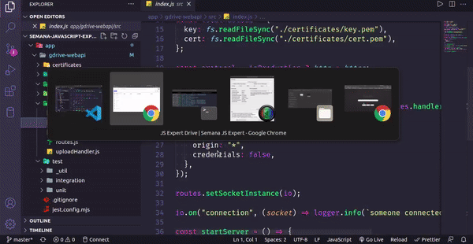

<h1 align="center">
    
    <br>
 
</h1>

</div><br>
<h2 id="sobre">🔎 Sobre o Projeto</h2>
Clone do Google Drive com funções de upload de arquivos sob demanda. O projeto foi desenvolvido durante a semana JSExpert, promovida pelo <a href="https://www.linkedin.com/in/erickwendel/">Erick Wendel </a>. Diversos conceitos avançados foram explorados, como Node.js Streams e módulos nativos do Node.js, com o mínimo de dependências de pacotes. A aplicação foi desenvolvida seguindo as boas práticas do TDD (Test Driven Development). Ao final, alcançamos 100% de corbertura do código, com testes unitários e de integração.<br>
<h2 id="tecnologias">⚙️ Tecnologias utilizadas</h2>
➙ <a href="https://nodejs.org/en/">Node.js</a> <br>
➙ <a href="https://github.com/mscdex/busboy#readme">Busboy</a><br>
➙ <a href="https://socket.io/">Socket IO </a> <br>
➙ <a href="https://jestjs.io/pt-BR/">Jest</a> <br>

<h2 id="layout">✨ Preview</h2>
<div align="center">

</div>
<br>

<h2>💡Rode na sua máquina</h2>

```
# Clone este repositório
$ git clone https://github.com/diegomagalhaes-dev/GDrive_clone.git

# Instale as dependências
$ npm install

# Inicie a aplicação 
    # (Server)
$ npm start (irá iniciar no caminho: https://localhost:3000)
    # (Front-end)
$ npm start (irá iniciar no caminho: https://0.0.0.0:3000)
# (necessário ter o Node (v16^), NPM e o GIT instalados na sua máquina)
```
